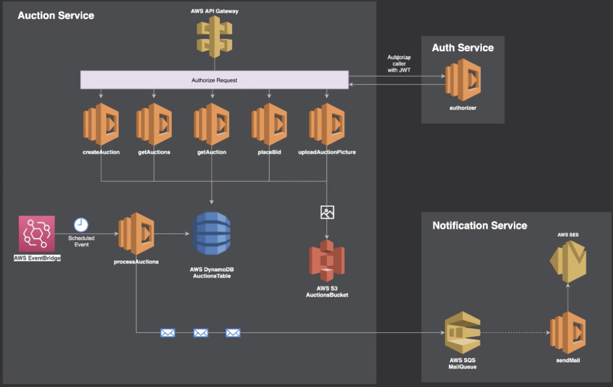

# Introduction #

A simple service for Auction utilizing serverless framework with cloudformation templates.



### Deploying
Service is deployed in aws CloudFormation

```
cd auction-service/ # or auth-service/
npm install
sls deploy -v
```

To redeploy a specific fuction ` sls deploy -f <function-name> -v

To remove existing deployment `sls remove -v`

## Gateway endpoint

https://dotsmz9pbg.execute-api.eu-west-1.amazonaws.com/{env}/{resource}

Possible values for <env> variable include `dev`, `staging` and `production`

## Taling the logs
`sls logs -f <functionName> -t`


## Endpoints:
```
    POST - /auction
    GET - /auctions
    GET - /auction/{id}
    PATCH - /auction/{id}
```
